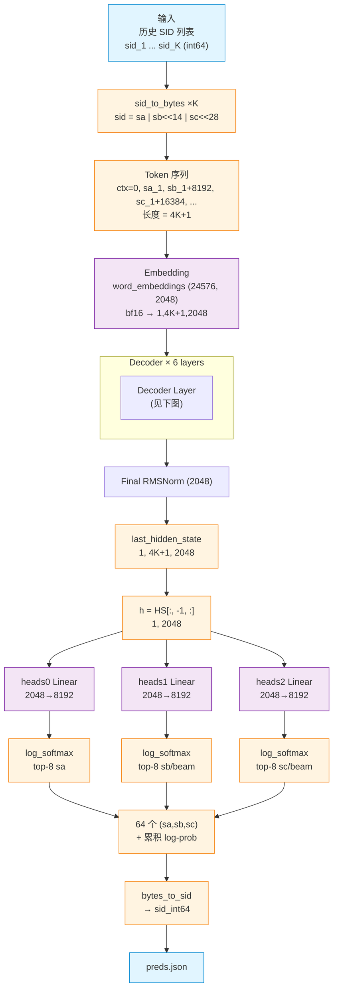
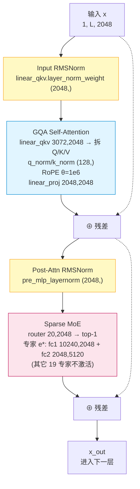
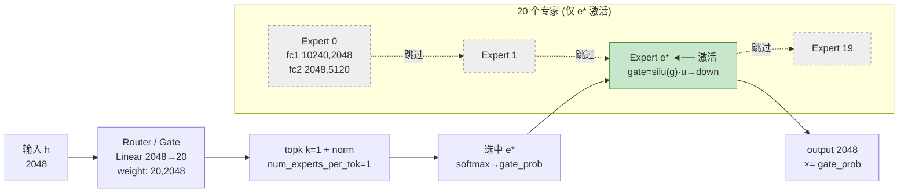
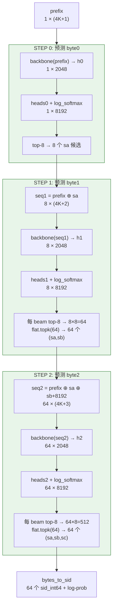

# RecIF SID Beam Search 模型结构图

> 配套文档：`model_analysis.md`（文字分析）。本文专注结构可视化，给出多种图：
> - **图 1**：端到端架构总览（ASCII）
> - **图 2**：单层 Decoder Block 细节（ASCII）
> - **图 3**：GQA + QKV 融合拆解（ASCII）
> - **图 4**：MoE top-1 路由细节（ASCII）
> - **图 5**：分层 Beam Search 时间线（ASCII）
> - **图 6-9**：Mermaid 渲染版（GitHub 可视化）

---

## 图 1：端到端架构总览（ASCII）

```
╔══════════════════════════════════════════════════════════════════════════════╗
║                         输入：用户历史 SID 列表                                  ║
║              [sid_1, sid_2, ..., sid_K]   (每个 int64)                          ║
╚════════════════════════════╤═════════════════════════════════════════════════╝
                             │
                   ┌─────────▼─────────┐
                   │  sid_to_bytes ×K  │   sid = sa | sb<<14 | sc<<28
                   └─────────┬─────────┘
                             │
╔════════════════════════════╧═════════════════════════════════════════════════╗
║  Token 序列（长度 = 4K+1）                                                     ║
║                                                                                ║
║  ┌───┬────┬─────┬─────┬───┬────┬─────┬─────┬─────────────┬───┐              ║
║  │ 0 │sa_1│sb_1 │sc_1 │ 0 │sa_2│sb_2 │sc_2 │  ... ...    │ 0 │              ║
║  │ctx│    │+8192│+16384│ctx│    │+8192│+16384│             │tgt│              ║
║  └───┴────┴─────┴─────┴───┴────┴─────┴─────┴─────────────┴─┬─┘              ║
║   └────── item_1 ──────┘ └────── item_2 ──────┘ └─ item_K ─┘ │              ║
║                              4 token / item                  │ 目标槽         ║
╚══════════════════════════════════════════════════════════════╪═══════════════╝
                             │                                  │
                             ▼                                  │
              ┌──────────────────────────────┐                  │
              │  Embedding Lookup            │                  │
              │  word_embeddings             │                  │
              │  shape: (24576, 2048) bf16   │                  │
              │  → [1, 4K+1, 2048]           │                  │
              └──────────────┬───────────────┘                  │
                             │                                  │
                             ▼                                  │
              ┌──────────────────────────────┐                  │
              │   Decoder Layer × 6          │ ◄── 见图 2       │
              │   (Qwen3-MoE Block)          │                  │
              └──────────────┬───────────────┘                  │
                             │                                  │
                             ▼                                  │
              ┌──────────────────────────────┐                  │
              │  Final RMSNorm (2048)        │                  │
              └──────────────┬───────────────┘                  │
                             │                                  │
                             ▼  last_hidden_state                │
                [1, 4K+1, 2048]                                 │
                             │                                  │
                             │   取最后一个位置 ◄────────────────┘
                             ▼
                       h ∈ [1, 2048]
                             │
          ┌──────────────────┼──────────────────┐
          │                  │                  │
          ▼ (step 0)         ▼ (step 1)         ▼ (step 2)
   ┌─────────────┐    ┌─────────────┐    ┌─────────────┐
   │  heads[0]   │    │  heads[1]   │    │  heads[2]   │
   │ Linear      │    │ Linear      │    │ Linear      │
   │ 2048→8192   │    │ 2048→8192   │    │ 2048→8192   │
   │ (8192,2048) │    │ (8192,2048) │    │ (8192,2048) │
   └──────┬──────┘    └──────┬──────┘    └──────┬──────┘
          │                  │                  │
       log_softmax         log_softmax         log_softmax
          │                  │                  │
          ▼                  ▼                  ▼
       top-8 sa          top-8 sb/beam      top-8 sc/beam
          │                  │                  │
          └──────────────────┴──────────────────┘
                             │
                             ▼
            64 个 (sa, sb, sc) + 累积 log-prob
                             │
                             ▼
                  bytes_to_sid → sid_int64
                             │
                             ▼
                    输出 preds.json
```

---

## 图 2：单层 Decoder Block 细节（重复 6 次）

```
                        ┌─────────────────────┐
   x (hidden=2048) ───▶│  Input RMSNorm      │
                        │  (2048,)            │
                        └──────────┬──────────┘
                                   │  ──────────────╮ (residual)
                                   ▼                │
              ┌────────────────────────────────────┐ │
              │      GQA Self-Attention            │ │
              │  ┌──────────────────────────────┐  │ │
              │  │  linear_qkv  (3072, 2048)    │  │ │
              │  │  融合 QKV:                   │  │ │
              │  │  4 kv组 × [Q(512)+K(128)+V(128)]│ │
              │  └──────────────┬───────────────┘  │ │
              │                 │ split            │ │
              │        ┌────────┼────────┐         │ │
              │        ▼        ▼        ▼         │ │
              │       Q(2048) K(512) V(512)        │ │
              │        │       │        │          │ │
              │     q_norm  k_norm      │          │ │
              │     (128,)  (128,)      │          │ │
              │        │       │        │          │ │
              │        └──RoPE(θ=1e6)───┘          │ │
              │                 │                  │ │
              │             attention              │ │
              │                 │                  │ │
              │       linear_proj (2048,2048)      │ │
              └────────────────┬───────────────────┘ │
                               │                     │
                               ◀─────────────────────╯ add (residual)
                               │
                        ┌──────▼──────┐
                        │ Post-Attn   │
                        │ RMSNorm     │  (pre_mlp_layernorm)
                        │ (2048,)     │
                        └──────┬──────┘
                               │  ──────────────╮ (residual)
                               ▼                │
              ┌────────────────────────────────────┐│
              │      Sparse MoE (top-1 of 20)      ││
              │  ┌──────────────────────────────┐  ││
              │  │  router/gate  (20, 2048)     │  ││
              │  │  → 20 logits                │  ││
              │  └──────────────┬───────────────┘  ││
              │                 │ topk=1 + norm    ││
              │        ┌────────▼─────────┐        ││
              │        │  选 1 个专家 e*  │        ││
              │        └────────┬─────────┘        ││
              │                 │                  ││
              │   ┌─────────────┼─────────────┐    ││
              │   │ ▼           ▼             │    ││
              │  E0 E1 ...    E_{e*}    ... E19    ││  (其它专家不激活)
              │   │             │             │    ││
              │   │      ┌──────▼──────┐      │    ││
              │   │      │ GatedMLP:   │      │    ││
              │   │      │ fc1 (10240, │      │    ││
              │   │      │     2048)   │      │    ││
              │   │      │  =gate├up   │      │    ││
              │   │      │ fc2 (2048,  │      │    ││
              │   │      │     5120)   │      │    ││
              │   │      │ silu(g)·u   │      │    ││
              │   │      │ → down      │      │    ││
              │   │      └──────┬──────┘      │    ││
              │   └─────────────┼─────────────┘    ││
              │                 │                  ││
              └────────────────┬┴──────────────────┘│
                               │                    │
                               ◀────────────────────╯ add (residual)
                               │
                               ▼
                          x_out (2048)
                          （进入下一层）
```

**单层权重清单（47 keys）**：

| 模块 | 权重 | shape |
|------|------|-------|
| Attn LN | `linear_qkv.layer_norm_weight` | (2048,) |
| QKV | `linear_qkv.weight` | (3072, 2048) |
| Q norm | `q_layernorm.weight` | (128,) |
| K norm | `k_layernorm.weight` | (128,) |
| O proj | `linear_proj.weight` | (2048, 2048) |
| MoE LN | `pre_mlp_layernorm.weight` | (2048,) |
| Router | `mlp.router.weight` | (20, 2048) |
| Experts fc1 | `experts.linear_fc1.weight{0..19}` | (10240, 2048) ×20 |
| Experts fc2 | `experts.linear_fc2.weight{0..19}` | (2048, 5120) ×20 |

---

## 图 3：GQA + QKV 融合拆解

```
Megatron 融合权重:  linear_qkv.weight  (3072, 2048)
                                      ▲
                                      │
              ┌───────────────────────┴────────────────────────┐
              │  按 [num_kv_heads=4, group=768, hidden=2048]   │
              │  reshape 为 (4, 768, 2048)                     │
              └───────────────────────┬────────────────────────┘
                                      │
            ┌─────────────┬───────────┴────────────┬─────────────┐
            │ kv_group 0  │   kv_group 1           │   ...       │ kv_group 3
            ▼             ▼                        ▼             ▼
        ┌─────────────────────────┐         ┌─────────────────────────┐
        │ [0:512]    → Q 头 0..3  │         │ 同构                     │
        │ [512:640]  → K 头 0     │         │                         │
        │ [640:768]  → V 头 0     │         │                         │
        └─────────────────────────┘         └─────────────────────────┘

拆分后（HF 布局）：
   q_proj.weight  (2048, 2048)   ← 16 query heads × 128
   k_proj.weight  ( 512, 2048)   ←  4 kv heads   × 128
   v_proj.weight  ( 512, 2048)   ←  4 kv heads   × 128

         ┌─────────────────────────────────────┐
         │  GQA:  16 Q heads 共享 4 KV heads    │
         │  group = 16 / 4 = 4 (每 4 个 Q 头共用 1 组 KV) │
         └─────────────────────────────────────┘
```

---

## 图 4：MoE top-1 路由细节

```
        输入 token 隐状态 h (2048)
                   │
                   ▼
        ┌────────────────────────┐
        │  Router: Linear(2048,20)│   weight: (20, 2048)
        └────────────┬───────────┘
                     │
                     ▼
        logits ∈ ℝ²⁰  (20 个专家打分)
                     │
                     ▼
              ┌──────────────┐
              │  topk(k=1)   │   ← num_experts_per_tok=1
              └──────┬───────┘
                     │
                     ▼
              选中 e* (1 个专家)
              softmax over top-1 → gate_prob
                     │
   ┌─────────────────┼─────────────────────┐
   │                 │                     │
   ▼                 ▼                     ▼
  E0             E_{e*}  ◄── 激活          E19   ◄── 不激活（跳过）
   │            ┌────┴────┐                 │
   │            │         │                 │
   │         ┌──▼──┐  ┌──▼──┐              │
   │         │gate_w│  │up_w │              │
   │         │5120  │  │5120 │              │
   │         │×2048 │  │×2048│              │
   │         └──┬──┘  └──┬──┘              │
   │            │silu     │                 │
   │            └────┬────┘                 │
   │                 │  element-wise ×      │
   │              ┌──▼───┐                  │
   │              │down_w│                  │
   │              │2048 ×│                  │
   │              │5120  │                  │
   │              └──┬───┘                  │
   │                 │ × gate_prob          │
   │                 │                      │
   └─────────────────┼──────────────────────┘
                     │
                     ▼
              output (2048)

激活参数：仅 31.46M / 单 token
（vs 全部 20 专家 629M, 稀疏度 = 1/20 = 5%）
```

---

## 图 5：分层 Beam Search 时间线

```
时间 ──────────────────────────────────────────────────────────────────────▶

   prefix = [0, sa_1, sb_1, sc_1, ..., 0]   (4K+1 tokens, K=历史长度)
   │
   ▼
┌─────────────────────────────────────────────┐
│ STEP 0: 预测 byte0 (sa)                     │
│                                             │
│   h0 = backbone(prefix)[:, -1, :]  [1,2048] │
│   lp0 = log_softmax(heads[0](h0)) [1,8192]  │
│   top-8 → (sa, s0)                          │
│                                             │
│   候选数: 1 → 8                              │
└────────────────────┬────────────────────────┘
                     │
                     ▼  把每个 sa 拼回序列
   seq1 = [prefix, sa]   (8 × (4K+2))
┌─────────────────────────────────────────────┐
│ STEP 1: 预测 byte1 (sb)                     │
│                                             │
│   h1 = backbone(seq1)[:, -1, :]   [8, 2048] │
│   lp1 = log_softmax(heads[1](h1)) [8, 8192] │
│   每 beam top-8 → (sb, s1)                   │
│                                             │
│   joint1 = s0[:,None] + s1   [8, 8]          │
│   flat.topk(64) → 64 个 (sa_k, sb_k)         │
│                                             │
│   候选数: 8 → 64 (剪枝)                      │
└────────────────────┬────────────────────────┘
                     │
                     ▼  把每个 sb+8192 拼回序列
   seq2 = [prefix, sa_k, sb_k+8192]  (64 × (4K+3))
┌─────────────────────────────────────────────┐
│ STEP 2: 预测 byte2 (sc)                     │
│                                             │
│   h2 = backbone(seq2)[:, -1, :]  [64, 2048] │
│   lp2 = log_softmax(heads[2](h2)) [64,8192] │
│   每 beam top-8 → (sc, s2)                   │
│                                             │
│   joint2 = top_s[:,None] + s2  [64, 8]      │
│   flat.topk(64) → 64 个最终 (sa,sb,sc)       │
│                                             │
│   候选数: 64 → 512 → 64 (剪枝)               │
└────────────────────┬────────────────────────┘
                     │
                     ▼
        bytes_to_sid(sa,sb,sc) → sid_int64
                     │
                     ▼
            64 个 (sid, log_prob)  排序输出
```

**分支因子 8/8/8 展开示意**：

```
                          root
                            │
              ┌─────────────┼─────────────┐  step 0: top-8 byte0
            sa_0          sa_3          sa_7
           (8 个)          │             │
            │              │             │
       ┌────┼────┐    ┌────┼────┐   ┌────┼────┐  step 1: 每 beam top-8 byte1
      sb_0 ... sb_7  sb_0 ... sb_7  sb_0 ... sb_7
       │             │             │
       ▼             ▼             ▼
      共 64 候选 → flat.topk(64) 留 64 个 (sa,sb)
       │
       ▼
   每个 (sa,sb) → 8 个 sc → flat.topk(64) → 64 个 (sa,sb,sc)
```

---

## 图 6：端到端架构（Mermaid，GitHub 可渲染）



---

## 图 7：单层 Decoder Block（Mermaid）



---

## 图 8：MoE 路由细节（Mermaid）



---

## 图 9：Beam Search 三步流程（Mermaid）



---

## 图 10：参数量分布饼图（文字版）

```
Backbone 总参 ≈ 3.89B (bf16 → 7.78 GB)

┌─────────────────────────────────────────────────┐
│ Embedding       50.3M    █ 1.3%                 │
│ 6× Attention    63.0M    ██ 1.6%                │
│ 6× MoE        3774.7M    ██████████████████████ │
│  Norms/router  ~10K     (忽略)                  │
└─────────────────────────────────────────────────┘
                          ▲
              98% 参数在 MoE FFN，top-1 路由只激活 5%

External heads = 3 × Linear(2048, 8192) = 50.3M
                + AdamW 优化器状态（推理不用）≈ 200M

激活参数（单 token 实算）:
    6 × (10.5M attn + 31.46M × 1 expert)
    = 6 × 42M ≈ 0.25B  ← README 标称 ~0.30B
```

---

## 图 11：词表（Token ID 空间）布局

```
Token ID
0                    8191  8192               16383  16384              24575
┌──────────────────────┬───────────────────────┬───────────────────────┐
│      sa 空间          │    sb 空间            │    sc 空间            │
│  (byte0, +0)         │  (byte1, +8192)       │  (byte2, +16384)      │
└──────────────────────┴───────────────────────┴───────────────────────┘
        ↑                       ↑                       ↑
   ctx=0 也在这区间       item 的第 3 个 token      item 的第 4 个 token
   (靠位置编码区分)         (sa, sb, sc 都在 0..8191)

vocab 总数 = 3 × 8192 = 24576
embedding.weight 实测 shape = (24576, 2048)
```

---

## 附：图例与说明

| 颜色/标记 | 含义 |
|----------|------|
| 蓝色框 (`#e1f5ff`) | Attention 相关 |
| 粉色框 (`#fce4ec`) | MoE 相关 |
| 黄色框 (`#fff9c4`) | LayerNorm |
| 绿色框 (`#c8e6c9`) | 激活路径 / 步骤 |
| 灰色虚线 | 跳过 / 残差连接 |
| `(shape)` | tensor 形状标注 |
| `2048→8192` | Linear in_features → out_features |

所有 shape 均来自真实权重核对（见 `model_analysis.md` 第 2-4 章）。
