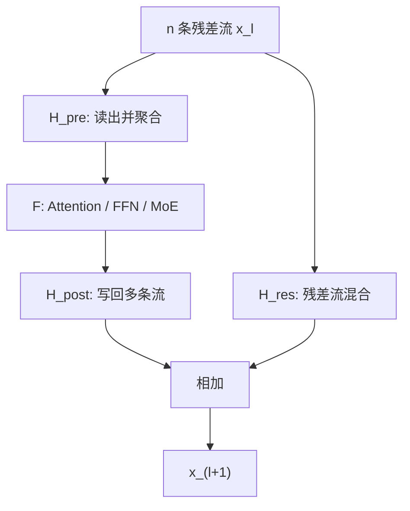

# mHC: Manifold-Constrained Hyper-Connections 学习笔记

> 论文：*mHC: Manifold-Constrained Hyper-Connections*，DeepSeek-AI，2026
>
> 目标：理解 Hyper-Connections (HC) 为什么会在深层训练中失稳，以及 mHC 如何用双随机矩阵约束和系统优化使其可扩展。

---

## 1. 一页总览

### 论文要解决什么？

标准 Transformer 使用残差连接：

$$
x_{l+1}=x_l+F(x_l,W_l)
$$

这里的直通项是恒等映射 `I`。它让浅层表示和梯度都有稳定路径跨越多层传播。

HC 将单条残差流扩展为 `n` 条流，并学习流之间的读、写、混合关系。这样能提高网络的宏观连接拓扑复杂度，但将恒等残差项替换为无约束矩阵 `H_res`。深层中这些矩阵连续相乘，可能造成信号或梯度爆炸、消失。

mHC 的核心做法：将每层残差混合矩阵 `H_res` 约束为双随机矩阵。

$$
H\mathbf{1}=\mathbf{1},\quad \mathbf{1}^\top H=\mathbf{1}^\top,\quad H\ge0
$$

这保留了多流之间的信息混合，同时使跨层复合映射保持受控。论文还用 kernel fusion、重计算和通信重叠解决多流结构带来的系统开销。

### 最重要的结论

$$
\text{可学习多流残差拓扑}
\quad+
\quad\text{双随机约束}
\quad+
\quad\text{系统优化}
$$

在论文的 27B MoE 预训练实验中，mHC 比普通残差获得约 `0.021` 的最终训练 loss 改善；复合残差映射的最大增益从 HC 的约 `3000` 降至约 `1.6`，并在 8 个下游 benchmark 中全部超过 Baseline、在 7 个中超过 HC。

---

## 2. 背景：普通残差为什么重要？

### 2.1 前向传播

标准残差层：

$$
x_{l+1}=x_l+F_l(x_l)
$$

展开到更深层：

$$
x_L=x_l+\sum_{i=l}^{L-1}F_i(x_i)
$$

其中始终有一个系数为 `1` 的浅层表示 `x_l`。网络不必在每层重新生成全部表示，而是学习对已有表示的增量修改。

这不是说信息完全不变，因为每个 `F_i(x_i)` 仍依赖之前的状态；它的关键是保留一条不经额外变换的直通成分。

### 2.2 反向传播

令：

$$
g_l=\frac{\partial\mathcal{L}}{\partial x_l},\qquad
J_l=\frac{\partial F_l(x_l)}{\partial x_l}
$$

则：

$$
g_l=(I+J_l)^\top g_{l+1}=g_{l+1}+J_l^\top g_{l+1}
$$

相较于普通深层网络的 Jacobian 连乘，残差层每一步都含有恒等项。它不保证训练绝不爆炸或消失，但在残差分支变化适中、初始化和归一化设计合理时，优化条件通常明显更好。

### 2.3 重要限定

残差连接并不是魔法：

$$
\prod_l(I+J_l)
$$

仍可能不稳定。它提供的是结构性的直通路径和更好的条件，而不是无条件稳定性保证。

---

## 3. 相关工作定位：micro-design 与 macro-design

| 类别 | 改什么 | 例子 |
|---|---|---|
| Micro-design | 一个 block 内怎样计算特征 | Attention、FFN、MQA、GQA、MLA、MoE |
| Macro-design | block 之间怎样连接、传递和汇合特征 | ResNet、DenseNet、FractalNet、DLA、HC、mHC |

mHC 属于 macro-design。它不替换 Attention 或 MoE，而是改变它们之间的残差信息路径。

### 3.1 与典型宏观连接的直觉比较

| 方法 | 连接方式 | 直觉 | 代价 |
|---|---|---|---|
| ResNet | 相邻层加恒等跳连 | 保留当前版本，再增量修改 | 拓扑较固定 |
| DenseNet | 每层接收所有此前层的特征 | 每层能阅读完整历史 | 特征与内存开销增长快 |
| FractalNet | 多条不同深度路径后融合 | 同时使用短路径与长路径 | 分支结构复杂 |
| DLA | 多个聚合节点逐级融合 | 分阶段汇总跨深度信息 | 聚合设计和调度更复杂 |
| HC | 多条残差流可学习地读、写、混合 | 动态学习连接图权重 | 可能不稳定且 I/O 大 |
| mHC | 受约束的 HC | 保留学习能力，同时约束传播 | 需要 Sinkhorn 与专门系统实现 |

---

## 4. HC 的机械结构

### 4.1 多流残差状态

普通残差状态：

$$
x_l\in\mathbb{R}^{C}
$$

HC 将其扩展为：

$$
x_l=(x_{l,0},x_{l,1},\ldots,x_{l,n-1})^{T}
\in\mathbb{R}^{n\times C}
$$

每行是一条 `C` 维残差流。论文实验中常取 `n=4`。

### 4.2 单层公式

$$
x_{l+1}=H_l^{res}x_l+(H_l^{post})^\top F(H_l^{pre}x_l,W_l)
$$

| 映射 | 形状 | 作用 |
|---|---:|---|
| `H_pre` | $1\times n$ | 从 `n` 条流加权读取，聚合为一个 `C` 维 block 输入 |
| `H_post` | $1\times n$ | 将 block 输出写回 `n` 条流 |
| `H_res` | $n\times n$ | 直接混合、更新已有残差流 |

### 4.3 为什么 `H_res` 最重要？

论文的消融结果：

| 启用组件 | 相对基线 Absolute Loss Gap |
|---|---:|
| 仅 `H_res` | `-0.022` |
| `H_res + H_pre` | `-0.025` |
| `H_res + H_pre + H_post` | `-0.027` |

更负表示 loss 更低。`H_res` 单独已经带来大部分收益，因此它是 HC 表达能力的关键来源，也成为最需要约束的部分。

### 4.4 动态映射与静态映射

HC/mHC 的映射可写成：

$$
H=\alpha\cdot \text{dynamic}(x_l)+b
$$

其中 `b` 是不依赖输入的静态默认连接，动态项由当前隐藏状态生成。小值初始化的门控 `alpha` 使训练初期映射接近静态结构，再逐渐学习输入自适应路由。

---

## 5. HC 的数值不稳定

### 5.1 跨层复合映射

将本层新增信息记为：

$$
u_l=(H_l^{post})^\top F(H_l^{pre}x_l,W_l)
$$

则：

$$
x_{l+1}=H_l^{res}x_l+u_l
$$

从第 `l` 层展开到第 `L` 层：

$$
x_L=P_{l\rightarrow L}x_l+
\sum_{i=l}^{L-1}H_{L-1}^{res}\cdots H_{i+1}^{res}u_i
$$

其中：

$$
P_{l\rightarrow L}=H_{L-1}^{res}\cdots H_l^{res}
$$

普通残差的对应映射始终为 `I`；HC 中则是无约束矩阵连乘。

### 5.2 一个两流例子

令残差混合矩阵 `H` 的系数为：

| 输出流 / 输入流 | 流 1 | 流 2 |
|---|---:|---:|
| 流 1 | 1.1 | 0.1 |
| 流 2 | 0.1 | 1.1 |

对共同方向 $v=(1,1)^{T}$：

$$
Hv=1.2v
$$

60 层后放大因子约为：

$$
1.2^{60}\approx56,000
$$

真实模型中的矩阵每层不同、也依赖输入，但这个例子说明了深度连乘为何危险：单层的轻微增益偏差可能被指数式累积。

### 5.3 论文如何测量增益？

对矩阵 `H`：

$$
\|H\|_\infty=\max_i\sum_j|H_{ij}|
$$

它控制前向信号最坏情况下的放大：

$$
\|Hx\|_\infty\le\|H\|_\infty\|x\|_\infty
$$

反向经过 `H^T`，其无穷范数等于原矩阵最大绝对列和：

$$
\|H^\top\|_\infty=\max_j\sum_i|H_{ij}|
$$

论文将这两个量称为 Amax Gain Magnitude：

| 指标 | 计算 | 含义 |
|---|---|---|
| Forward Gain | 复合映射的最大绝对行和 | 前向残差状态的最坏放大 |
| Backward Gain | 复合映射的最大绝对列和 | 残差路径上的最坏梯度放大 |

在 27B HC 中，复合映射的峰值约为 `3000`，并伴随约 `12k` step 附近的 loss surge 和不稳定 gradient norm。

### 5.4 严谨理解

无约束并不逻辑上意味着模型一定失稳，模型理论上可以恰好学到恒等矩阵。但无约束设计没有任何机制保证深层复合仍接近恒等，因此一旦训练将其推入高增益区域，残差通路会失去保护。

此外，Amax Gain 是残差混合路径的诊断，并不是完整 Transformer Jacobian 的精确范数。

---

## 6. mHC：双随机残差混合

### 6.1 约束集合

作者将 `H_res` 投影到双随机矩阵集合：

$$
\mathcal{M}^{res}=\{H\in\mathbb{R}^{n\times n}\mid
H\mathbf{1}=\mathbf{1},\;
\mathbf{1}^{T}H=\mathbf{1}^{T},\;H_{ij}\ge0\}
$$

该集合也叫 Birkhoff polytope。严格说它是凸多面体而非通常意义上的光滑流形；论文中的 `manifold` 可理解为“受约束的参数空间”。

### 6.2 直观例子

一个例子的 `H` 为：

| 输出流 / 输入流 | 流 1 | 流 2 | 流 3 |
|---|---:|---:|---:|
| 流 1 | 0.7 | 0.2 | 0.1 |
| 流 2 | 0.2 | 0.6 | 0.2 |
| 流 3 | 0.1 | 0.2 | 0.7 |

对：

$$
x=(1,4,10)^{T}
$$

有：

$$
Hx=(2.5,4.6,7.9)^{T}
$$

总和保持：

$$
1+4+10=2.5+4.6+7.9=15
$$

它允许流之间重新分配信息，但不能凭空增加或减少所有流的总量。

### 6.3 三个关键性质

#### 非负 + 行和为 1：每条输出是凸组合

$$
y_i=\sum_jH_{ij}x_j
$$

每个 `y_i` 是输入流的加权平均，不能因为连接系数本身而超出输入流的最小/最大范围。

#### 列和为 1：跨流平均值守恒

$$
\mathbf{1}^\top Hx=\mathbf{1}^\top x
$$

因此多流总量和平均值不随单层混合系统性漂移。

#### 范数受控与复合封闭

双随机矩阵可表示为排列矩阵的凸组合：

$$
H=\sum_k\lambda_kP_k,\qquad
\lambda_k\ge0,\quad\sum_k\lambda_k=1
$$

因此：

$$
\|H\|_2\le1
$$

并且两个双随机矩阵的乘积仍双随机：

$$
A,B\in\mathcal{M}^{res}\Rightarrow AB\in\mathcal{M}^{res}
$$

这保证理想状态下跨任意深度的残差复合映射继续受控。

### 6.4 它保留了什么？牺牲了什么？

- 恒等矩阵 `I` 本身是双随机矩阵，因此普通残差被包含在 mHC 的可行集合中。
- 任意排列矩阵也是双随机矩阵，因此 mHC 可路由、交换流。
- 排列矩阵的凸组合允许平滑混合流。
- 代价是禁止任意负权重、任意放大和强对冲，可能牺牲一部分表达自由度。

这解释了为什么 mHC 在 MATH 上略低于 HC，但整体更稳定、更可扩展。

---

## 7. 非负 `H_pre/H_post` 与信号抵消

mHC 还约束：

$$
H_l^{pre}\ge0,\qquad H_l^{post}\ge0
$$

其目的不是让读写映射双随机，而是减少由正负大系数主动制造的抵消。

例如：

$$
z=10,000x_1-10,000x_2
$$

若 `x_1` 与 `x_2` 非常接近，结果 `z` 可能很小，但计算需要先表示两个很大的量再相减。混合精度下，两个大值的舍入误差会在相减后被放大，这称为灾难性消去。

梯度也可能大：

$$
z=10x_1-10x_2
\Rightarrow
\frac{\partial z}{\partial x_1}=10,\quad
\frac{\partial z}{\partial x_2}=-10
$$

即使输出因抵消而接近零，反向梯度仍可能很大。

实现中：

$$
H_l^{pre}=\sigma(\tilde H_l^{pre})\in(0,1)
$$

$$
H_l^{post}=2\sigma(\tilde H_l^{post})\in(0,2)
$$

非负且有上界可以限制系数诱导的正负对冲和无界增益。它不能消除所有抵消，因为激活值本身仍可有正负；限制的是连接系数主动制造的抵消。

---

## 8. 参数化与 Sinkhorn-Knopp 投影

### 8.1 生成原始映射

先展平多流状态：

$$
\bar{x}_l=\mathrm{vec}(x_l)\in\mathbb{R}^{1\times nC}
$$

归一化：

$$
\bar{x}'_l=\mathrm{RMSNorm}(\bar{x}_l)
$$

再由线性投影、门控和静态偏置产生未约束映射：

$$
\tilde H_l^{pre}=\alpha_l^{pre}(\bar{x}'_l\varphi_l^{pre})+b_l^{pre}
$$

$$
\tilde H_l^{post}=\alpha_l^{post}(\bar{x}'_l\varphi_l^{post})+b_l^{post}
$$

$$
\tilde H_l^{res}=\alpha_l^{res}\mathrm{mat}(\bar{x}'_l\varphi_l^{res})+b_l^{res}
$$

形状：

| 参数 | 形状 |
|---|---:|
| `phi_pre`, `phi_post` | $nC\times n$ |
| `phi_res` | $nC\times n^2$ |
| `H_tilde_pre`, `H_tilde_post` | $1\times n$ |
| `H_tilde_res` | $n\times n$ |

### 8.2 Sinkhorn-Knopp

先确保元素为正：

$$
M^{(0)}=\exp(\tilde H_l^{res})
$$

然后交替行归一化、列归一化：

$$
M^{(t)}=T_r(T_c(M^{(t-1)}))
$$

其中：

$$
T_r(M)_{ij}=\frac{M_{ij}}{\sum_kM_{ik}},\qquad
T_c(M)_{ij}=\frac{M_{ij}}{\sum_kM_{kj}}
$$

理论上 `t -> infinity` 时收敛到双随机矩阵。论文实际取：

$$
t_{max}=20
$$

仅做行 softmax 只能保证行和为 1，不能保证列和；Sinkhorn 的交替归一化正是为同时满足两类约束。

### 8.3 有限迭代的影响

`20` 次迭代只得到近似双随机矩阵，列和误差可能在跨层复合中累积。因此实际 mHC 的最大 gain 不必严格为 1，这也是实验中出现约 `1.6` 的原因之一。

---

## 9. 系统实现：为什么需要专门优化？

### 9.1 FLOPs 小不等于运行成本小

`H_res` 在 `n=4` 时只是 `4 x 4` 矩阵，计算很轻；但它作用在 `4C` 宽的残差状态上，需要大量从显存读取、写回数据。

论文只统计残差流维护的前向 I/O：

| 方法 | 总读取 | 总写入 |
|---|---:|---:|
| 普通残差 | $2C$ | $C$ |
| HC/mHC | $(5n+1)C+n^2+2n$ | $(3n+1)C+n^2+2n$ |

当 `n=4` 时，主导项约为读取 `21C`、写入 `13C`；普通残差是读取 `2C`、写入 `C`。这不是端到端训练会慢 11 倍，因为表中不包括 Attention/FFN，但足以说明朴素实现会遭遇 memory wall。

### 9.2 Kernel fusion

作者的策略：

1. 将 RMSNorm 的除范数操作后移。因为：

   $$
   \mathrm{RMSNorm}(x)\varphi=\frac{x\varphi}{r}
   $$

   可先计算投影和 RMS，再缩放，避免物化完整归一化向量。
2. 融合投影、范数统计、门控、sigmoid、Sinkhorn 等小操作，减少 kernel launch 和中间张量。
3. 将 Sinkhorn 的 20 次迭代尽量放在单个 kernel 内，反向时在片上重算中间量。
4. 融合：

   $$
   H_l^{res}x_l+(H_l^{post})^\top F(\cdot)
   $$

   与残差合并，减少中间 `nC` 张量的读写。

论文报告，这一融合将相关 kernel 的读取从 $(3n+1)C$ 降到 $(n+1)C$，写入从 $3nC$ 降到 $nC$。

### 9.3 Recomputing

训练反向不能保存所有层的 `nC` 多流激活。作者把连续 `L_r` 层划为一个 recomputation block：

- 每个 block 保存入口 `x_{l_0}`，大小 `nC`。
- 每层保存昂贵 block 函数 `F` 的输出，大小 `C`。
- mHC 的映射与中间状态不保存，反向时从 block 入口重算。

对影响 `L_r` 的内存项：

$$
M(L_r)\approx nC\frac{L}{L_r}+(n+2)CL_r
$$

最优 block 长度：

$$
L_r^*\approx\sqrt{\frac{nL}{n+2}}
$$

小 block 需要保存更多边界状态；大 block 在反向重算时需要更多瞬时内存。论文还将 block 边界与 pipeline stage 对齐，避免跨设备重算依赖。

### 9.4 通信-计算重叠

pipeline parallel 中，stage 之间必须发送激活。mHC 的状态由 `C` 变为 `nC`，通信量随 `n` 增大。

作者扩展 DualPipe 调度：

- 将时间敏感的 `F_post,res` kernel 放在高优先级计算流，尽早产出可发送的残差状态。
- 避免 Attention 长期 persistent kernel 阻塞高优先级任务。
- block 起点已经在本地缓存，mHC 重算可与 pipeline 通信解耦并重叠。

论文在其内部大规模训练栈、`n=4` 配置下报告训练额外时间开销约 `6.7%`。这不是所有硬件和所有朴素实现都能直接获得的数字。

---

## 10. 实验设计

### 10.1 对照组

| 组别 | 残差结构 |
|---|---|
| Baseline | 普通残差连接 |
| HC | 无约束 Hyper-Connections |
| mHC | 双随机约束的 HC |

HC 与 mHC 都设 `n=4`，因此它们的差异主要来自约束和实现，而非残差流数量不同。

### 10.2 训练配置与验证目标

作者使用受 DeepSeek-V3 启发的 MoE 语言模型，设置：

| 设置 | 用途 |
|---|---|
| 27B，数据量与参数规模成比例 | 主稳定性、下游 benchmark、系统结果 |
| 3B、9B，数据量与规模成比例 | compute scaling |
| 3B，固定训练 1T tokens | token scaling |

这主要验证：mHC 是否在更大模型和更久训练下仍保持收益。

---

## 11. 主实验结果

### 11.1 训练稳定性

在 27B 实验中：

- HC 出现 loss surge 和明显不稳定的 gradient norm。
- mHC 训练 loss 曲线更平滑，最终相对 Baseline 的 loss 改善约 `-0.021`。
- mHC 的 gradient norm 轮廓与 Baseline 更接近，明显优于 HC 的高波动曲线。

### 11.2 下游 benchmark

| Benchmark | Baseline | HC | mHC | mHC - Baseline | mHC - HC |
|---|---:|---:|---:|---:|---:|
| BBH (EM) | 43.8 | 48.9 | **51.0** | +7.2 | +2.1 |
| DROP (F1) | 47.0 | 51.6 | **53.9** | +6.9 | +2.3 |
| GSM8K (EM) | 46.7 | 53.2 | **53.8** | +7.1 | +0.6 |
| HellaSwag (Acc.) | 73.7 | 74.3 | **74.7** | +1.0 | +0.4 |
| MATH (EM) | 22.0 | **26.4** | 26.0 | +4.0 | -0.4 |
| MMLU (Acc.) | 59.0 | 63.0 | **63.4** | +4.4 | +0.4 |
| PIQA (Acc.) | 78.5 | 79.9 | **80.5** | +2.0 | +0.6 |
| TriviaQA (EM) | 54.3 | 56.3 | **57.6** | +3.3 | +1.3 |

结论：

$$
\text{mHC 超过 Baseline：8/8}
$$

$$
\text{mHC 超过 HC：7/8}
$$

MATH 上 mHC 比 HC 低 `0.4`，说明约束可能带来局部表达自由度的代价。论文未报告多随机种子或置信区间，因此 `0.4-0.6` 这类小差异是否显著不能仅由表格判断。

### 11.3 Scaling

#### Compute scaling

在 `3B -> 9B -> 27B` 的 compute-optimal 配置中，mHC 的相对 loss 优势持续存在，尽管绝对 gap 有轻微衰减。可得出的稳妥结论是：在论文测试范围内，收益没有随规模扩大而崩塌。

#### Token scaling

固定 3B、增加训练 token 时，mHC 始终低于 Baseline；优势随训练变久有所收敛，但没有消失。

---

## 12. 机制验证：mHC 的 gain 是否真的受控？

理想的精确双随机矩阵应使前向、反向 Amax Gain 均为 `1`。

论文实际使用 20 次 Sinkhorn，因此得到近似约束：

- 单层前向 gain 基本为 `1`；
- 单层反向 gain 略偏离 `1`；
- 多层复合后最大 gain 约为 `1.6`。

与 HC 的约 `3000` 相比：

$$
\frac{3000}{1.6}\approx1875
$$

即约三个数量级的改善。

矩阵可视化显示：

- HC 的单层和复合矩阵含大正负值，深层复合后部分元素到数百量级。
- mHC 的矩阵非负，单层常接近排列路由，复合后权重逐渐在流之间分散，形成稳定融合。

---

## 13. 对论文的批判性总结

### 13.1 强项

1. **问题抓得准确**：不是笼统说 HC 不稳定，而是定位到 `H_res` 的跨层矩阵连乘。
2. **理论与实验相连**：双随机约束、复合封闭性、Amax Gain、gradient norm 和 loss surge 形成完整证据链。
3. **不忽略系统**：正面处理 memory I/O、激活和 pipeline 通信，避免算法贡献停留在纸面。
4. **结果一致性好**：mHC 在 27B 上稳定训练，且大多数下游指标优于 HC。

### 13.2 边界与潜在局限

1. `Birkhoff polytope` 被称为 manifold 的术语并不严格，它是凸多面体。
2. 有限 Sinkhorn 不是精确投影，因此理论上的严格 gain=1 在实践中变为近似约束。
3. 双随机 `H_res` 只强约束残差混合路径，不能单独保证整个 Transformer Jacobian 都稳定。
4. 非负 `H_pre/H_post` 限制的是由系数符号导致的抵消，不能消除激活本身正负造成的全部抵消。
5. 实验主要是受 DeepSeek-V3 启发的 MoE LLM；对纯稠密模型、视觉模型或其他架构的泛化尚未展示。
6. compute scaling 只有三个模型规模点，token scaling 只在 3B 上进行，不能视作完整 scaling law。
7. 正文未报告多随机种子、方差或统计显著性；小 benchmark 差异需谨慎解读。
8. `6.7%` 的系统开销依赖作者的 kernel 和分布式训练栈，朴素实现未必能复现。

---

## 14. 推荐复习路线

### 第一遍：把主线讲清楚

1. 为什么普通残差的 `I` 有利于前向和反向传播？
2. HC 如何用 `H_pre/H_post/H_res` 把一条流变成多条流？
3. 为什么 `H_res` 连乘是主风险？
4. 双随机矩阵为何能保留混合又限制增益？

### 第二遍：推导关键式

1. 从 $x_{l+1}=H_l^{res}x_l+u_l$ 展开得到复合映射。
2. 推导最大绝对行和和前向 $L_\infty$ 放大的关系。
3. 推导最大绝对列和和反向 $H^\top$ 传播的关系。
4. 证明双随机矩阵对乘法封闭。
5. 对 $M(L_r)=nCL/L_r+(n+2)CL_r$ 求导，得到最优重算 block 长度。

### 第三遍：用审稿人视角提问

1. 为什么选双随机而不是正交矩阵、谱归一化或残差缩放？
2. 如何在不同 `n` 下权衡表达能力、稳定性和 I/O？
3. 不同 Sinkhorn 迭代次数如何影响 gain、速度和下游效果？
4. 能否将该约束推广到 attention head、expert 路由或跨层 memory？
5. mHC 的非负约束是否损失了某些依赖差分/抑制的能力？

---

## 15. 最后的记忆卡

$$
\boxed{
\text{HC 的收益来自多流残差混合；HC 的风险也来自多流残差混合。}
}
$$

$$
\boxed{
\text{mHC 不把连接固定为 I，而是把可学习连接限制在稳定的双随机集合中。}
}
$$

$$
\boxed{
\text{深度学习架构创新不仅是算子设计，也包括信息在层之间如何被路由、守恒和融合。}
}
$$
