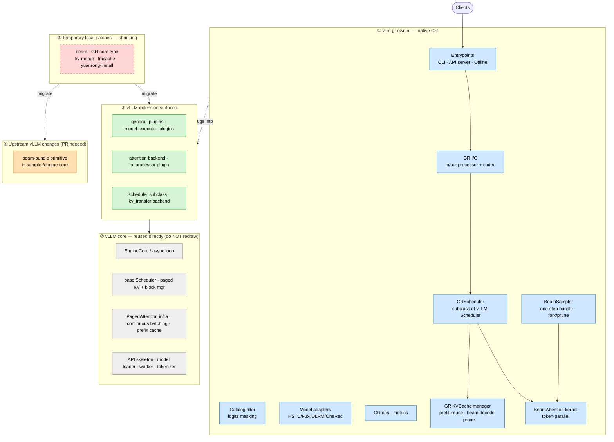

```mermaid
graph TD
    Client([Clients])

    subgraph OWN["① vllm-gr owned — native GR"]
        EP["Entrypoints<br/>CLI · API server · Offline"]
        IO["GR I/O<br/>in/out processor + codec"]
        BS["BeamSampler<br/>one-step bundle · fork/prune"]
        CAT["Catalog filter<br/>logits masking"]
        ADP["Model adapters<br/>HSTU/Fuxi/DLRM/OneRec"]
        OPS["GR ops · metrics"]
        SCHED["GRScheduler<br/>subclass of vLLM Scheduler"]
        KV["GR KVCache manager<br/>prefill reuse · beam decode · prune"]
        BATTN["BeamAttention kernel<br/>token-parallel"]
    end

    subgraph EXT["③ vLLM extension surfaces"]
        EXT1["general_plugins · model_executor_plugins"]
        EXT2["attention backend · io_processor plugin"]
        EXT3["Scheduler subclass · kv_transfer backend"]
    end

    subgraph REUSE["② vLLM core — reused directly (do NOT redraw)"]
        VC1["EngineCore / async loop"]
        VC2["base Scheduler · paged KV + block mgr"]
        VC3["PagedAttention infra · continuous batching · prefix cache"]
        VC4["API skeleton · model loader · worker · tokenizer"]
    end

    subgraph UP["④ Upstream vLLM changes (PR needed)"]
        UP1["beam-bundle primitive<br/>in sampler/engine core"]
    end

    subgraph PATCH["⑤ Temporary local patches — shrinking"]
        P1["beam · GR-core type<br/>kv-merge · lmcache · yuanrong-install"]
    end

    Client --> EP
    EP --> IO
    IO --> SCHED
    SCHED --> KV
    SCHED --> BATTN
    BS --> BATTN

    OWN -.->|"plugs into"| EXT
    EXT --> REUSE
    PATCH -.->|migrate| EXT
    PATCH -.->|migrate| UP

    classDef own fill:#cfe8ff,stroke:#1f77b4,color:#000
    classDef ext fill:#d6f5d6,stroke:#2ca02c,color:#000
    classDef reuse fill:#eeeeee,stroke:#888888,color:#000
    classDef up fill:#ffe0b3,stroke:#ff7f0e,color:#000
    classDef patch fill:#ffd6d6,stroke:#d62728,color:#000,stroke-dasharray:5 5

    class EP,IO,BS,CAT,ADP,OPS,SCHED,KV,BATTN own
    class EXT1,EXT2,EXT3 ext
    class VC1,VC2,VC3,VC4 reuse
    class UP1 up
    class P1 patch
```
